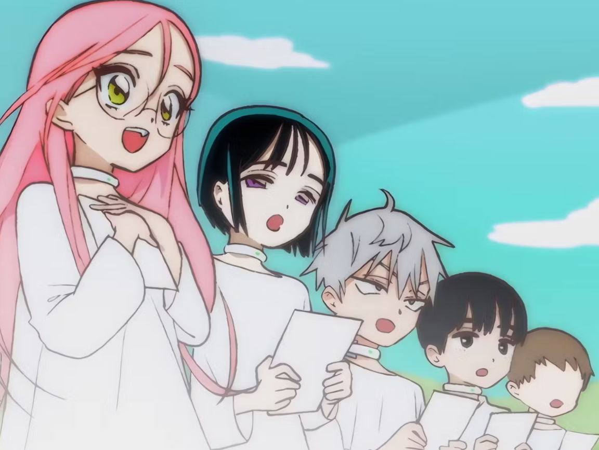
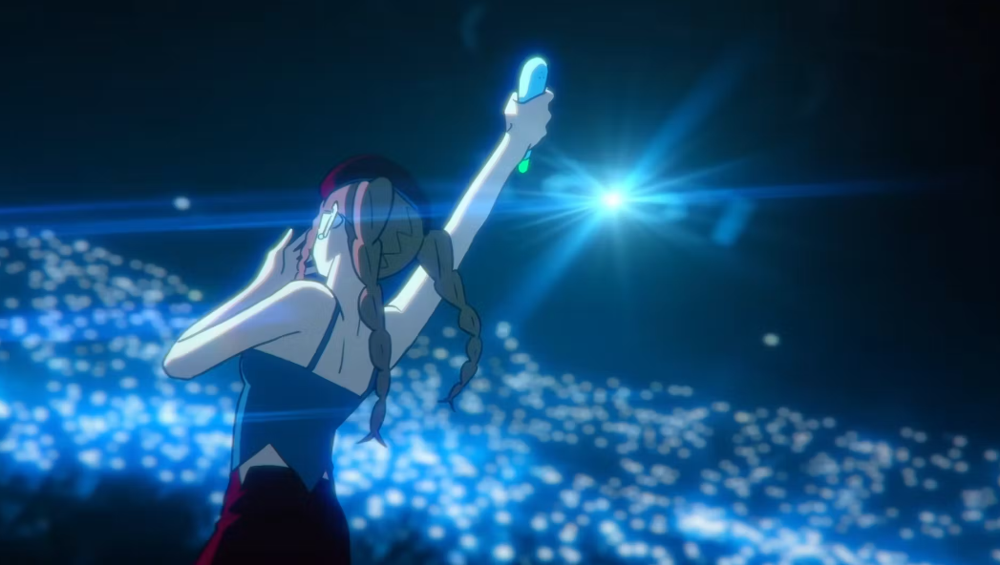
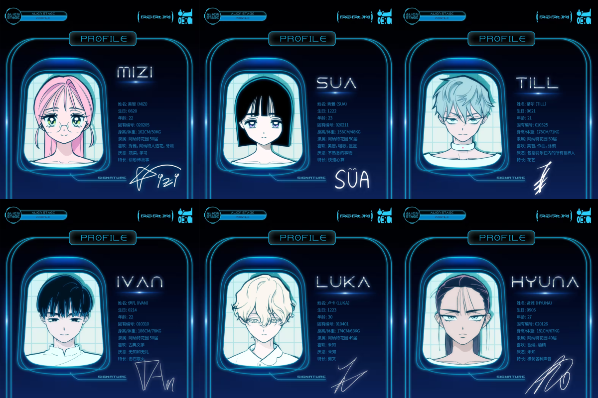
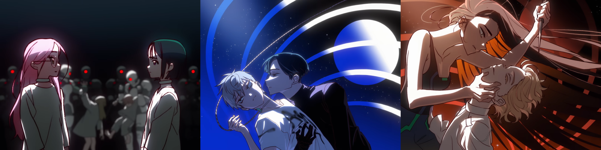

你喜歡看選秀節目嗎？ 如果是的話，不妨讓我帶你來瞭解一個由韓國繪師 VIVINOS 老師以及他的團隊打造的音樂企劃－－Alien Stage（異星舞台）。

### 前言（作者碎碎唸）

時間回溯到 2024 年 4 月初，身為重度推特使用者的我當時並不知道出於什麼原因，Tweet Lists 上經常出現跟「外星人舞台」有關的字眼，搭配一張看起來很有 **CP 感**的截圖。

如果單看直譯的名稱「外星人舞台」這幾個字，感覺就會出現很多黃黃綠綠又噁心的圖片，因為這麼膚淺的理由，雖然知道這個企劃的存在，但我並沒有深入探究下去。

直到某天同樣是在推特河道上飄來了一個太太的貼文，瞬間引起了我的興趣：

<blockquote class="twitter-tweet"><p lang="zh" dir="ltr">十大美德<br>勇敢：我自己去看外星人舞台<br>樂觀：明天就會有人看外星人舞台<br>積極：我現在就看外星人舞台<br>溝通：要不要看外星人舞台<br>社交：我朋友也看外星人舞台<br>坦然：外星人舞台很好看<br>誠實：其實我看不懂外星人舞台<br>利他：提醒你官方有更新<br>自省：我應該再看一次外星人舞台<br>公正：你們全都要看外星人舞台</p>&mdash; 😭@歐美翁A31 (@aaabbc543210) <a href="https://twitter.com/aaabbc543210/status/1779728525429555307?ref_src=twsrc%5Etfw">April 15, 2024</a></blockquote> <script async src="https://platform.twitter.com/widgets.js" charset="utf-8"></script>

當時我的內心：「到底外星人舞台有什麼神奇的魅力，居然讓這位太太的精神狀態變得如此美麗？我太愛了，我要去查！」

俗話說好奇心能掐死一隻貓，如果時間能夠退回那一天，<s>我寧願我永遠都不要入坑</s>（？）

先附上一篇寫得很好的補充教材：

[𝗔𝗹𝗶𝗲𝗻 𝗦𝘁𝗮𝗴𝗲🌠短短不到5分鐘，心痛到無法呼吸 ˖๋ ࣭ ⭑慎入⚠️推坑](https://www.dcard.tw/f/acg/p/255254687)

---

簡單來說，這個企劃的世界觀是在講述地球已經毀滅了，外星人（世界民）成為宇宙的主宰，將倖存的人類小孩抓走當作寵物來豢養，變成所謂的「寵物人」。

世界民會透過金錢交易來購買寵物人、送寵物人到專門培育音樂創作及歌唱技巧的才藝補習班。



長大後就會被派去參加「Alien Stage」，也就是本次企劃的核心。名義上是像演唱會一樣的音樂選秀節目，採 1v1 的PK 賽制，可以看出現場是如此的熱鬧非凡 👇



除了贏的那方可以晉級，更殘酷的是輸的那方就會猶如被**宣判死刑**，在舞台上當場處死！簡直就只是外星人看人類之間的互相競爭及的殺戮娛樂秀啊 😭

也許在那個世界觀中，死了對他們來說也是種另類的解脫吧（只能這樣安慰自己 🥲）。

本作中最大的看點，也是最令人揪心的部分，就是六位主角角色之間的愛恨情仇了。

附上一張官方前幾天才更新、熱騰騰的參賽人員個人檔案：



不管你是喜歡 GL、BL 還是 BG，滿滿的 CP 在外星人舞台上通通都找得到！（只能說貴圈真亂啊，但我還是吃得很香）



角色之間幾乎沒有台詞對白，劇情都是透過歌曲的 MV 來呈現，全部看完花不到 30 分鐘，但後勁大概可以持續 30 天。

如果你喜歡「BE」、「虐戀」等等題材，那就絕對不能錯過這個精彩的企劃！

想看中文字幕的歌詞的話，可以到官方的 Bilibili 看，按照播放清單的順序看下去就可以了：[合集·🌠 ALIEN STAGE](https://www.bilibili.com/video/BV1ag4y1W78U/?spm_id_from=333.999.section.playall)

題外話這是我最喜歡的一首歌：

<iframe width="560" height="315" src="https://www.youtube.com/embed/2cFnfD4iZzM?si=RT15FMZgH9zP3JlZ" title="YouTube video player" frameborder="0" allow="accelerometer; autoplay; clipboard-write; encrypted-media; gyroscope; picture-in-picture; web-share" referrerpolicy="strict-origin-when-cross-origin" allowfullscreen></iframe>

（IVAN 真的太會唱了，自帶哭腔的嗓音，真的把他內心的無助跟心碎表現得很到位QQ）

---

附上官方的資訊：

> [IG](https://www.instagram.com/vivinos__?igsh=MWwycHpjZjc2aTJuaw%3D%3D) <br>
> [推特](https://twitter.com/official_alnst?s=21&t=GacOwyspajom3oC_273nOQ) <br>
> [Bilibili](https://space.bilibili.com/1816400749?spm_id_from=333.337.search-card.all.click)

順帶一提，官方 B 站的投稿圖文裡，有更多老師的小短漫＆補充設定，如果深陷在坑裡想找糧吃的話，也可以到那塊大寶地去挖挖看 XD

```plaintext
以上，你也喜歡外星舞台嗎？歡迎留言跟我分享你最喜歡的一首歌＆你最喜歡的 CP 吧！
如果你是因為這篇文章才去看的，也可以回來告訴我看完後的心得感想唷～
```