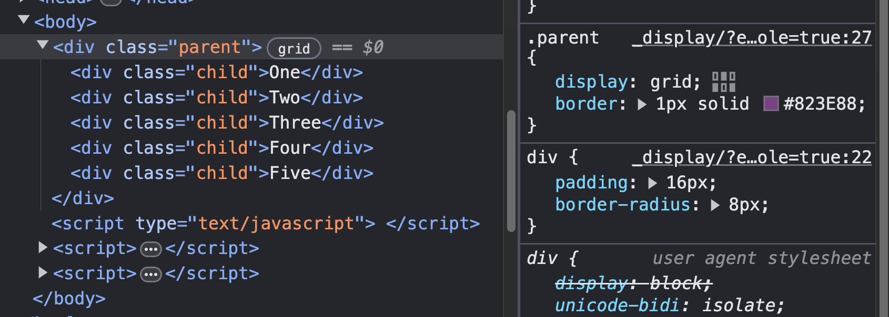
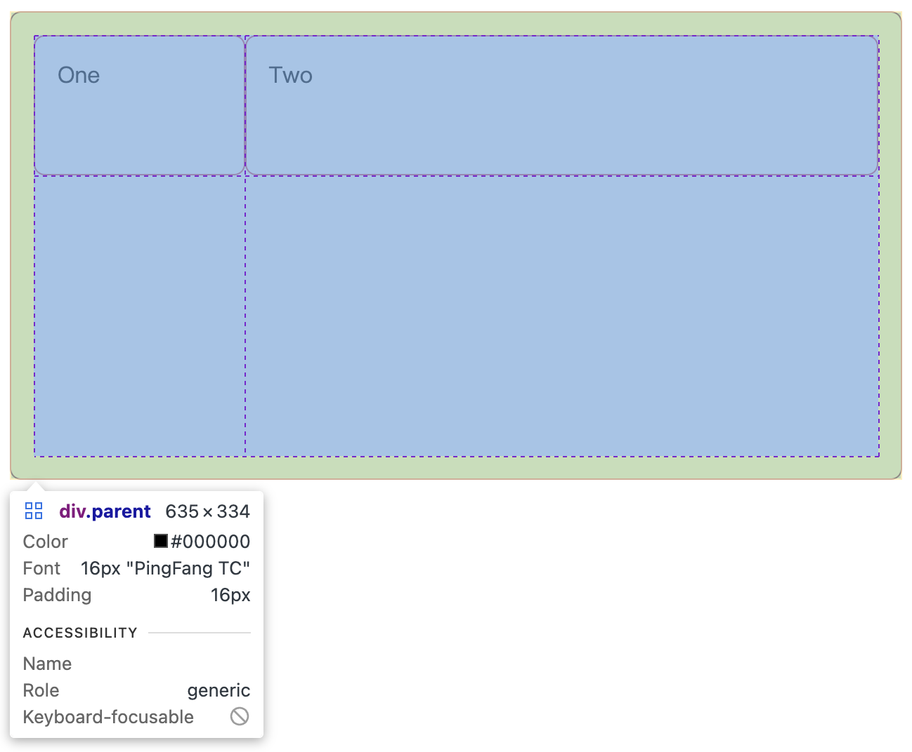

在排版的時候，我自己最常用的方法就是 `flex`，幾乎百分之八十的版面都可以靠這個屬性打天下。

然而當想呈現比較複雜的版面設計，例如 Dashboard 或 Bento Grid 時，`grid` 屬性用起來方便、靈活度極高，就能夠更輕鬆幫助我們打造需要的版型。

底下就來跟大家介紹一下哩～🙌

---

# 設置格線容器

有一個名為 `parent` 的容器，裡面包著數個子層 div，結構如下：

```html
<div class="parent">
  <div>One</div>
  <div>Two</div>
  <div>Three</div>
  <div>Four</div>
  <div>Five</div>
</div>
```

想開始使用 CSS 的格線系統，跟 `flex` 一樣，我們必須先對「父容器」設定一個 `display` 的屬性。

```css
.parent {
  display: grid;
}
```

剛設定完後，乍看之下雖然與一開始沒有什麼不同，但只要打開 Dev Tool 中的格線檢測器，就可以看到 `parent` 旁邊多了小標示。



# 設置 Column & Row 數量

介紹 **`grid-template-columns`** 跟 **`grid-template-rows`** 這兩個屬性。

Grid 系統預設是使用「單欄」的 Layout，我們先在**父容器**使用 `grid-template-columns` 來明確定義「欄位數量」跟「寬度比例」。

<iframe height="300" style="width: 100%;" scrolling="no" title="Grid Basic - 設置格線容器" src="https://codepen.io/mini891110/embed/wvLyOYb?default-tab=html%2Cresult" frameborder="no" loading="lazy" allowtransparency="true" allowfullscreen="true">
  See the Pen <a href="https://codepen.io/mini891110/pen/wvLyOYb">
  Grid Basic - 設置格線容器</a> by Qiuuuu2 (<a href="https://codepen.io/mini891110">@mini891110</a>)
  on <a href="https://codepen.io">CodePen</a>.
</iframe>

從上述的例子來看，對 `parent` 給 `grid-template-columns` 屬性兩個值 `25%` 及 `75%`，將格線系統一列設成兩欄，並對每欄給予指定的寬度比例。

如果父容器有超過兩個子容器，則會自動換列，結果如下圖：

<iframe height="300" style="width: 100%;" scrolling="no" title="Grid Basic - 設置 Column &amp; Row（自動換行）" src="https://codepen.io/mini891110/embed/RwzQObE?default-tab=html%2Cresult" frameborder="no" loading="lazy" allowtransparency="true" allowfullscreen="true">
  See the Pen <a href="https://codepen.io/mini891110/pen/RwzQObE">
  Grid Basic - 設置 Column &amp; Row（自動換行）</a> by Qiuuuu2 (<a href="https://codepen.io/mini891110">@mini891110</a>)
  on <a href="https://codepen.io">CodePen</a>.
</iframe>

除了使用 `%`、`px` 等基本單位，也可以使用只在 Grid 出現的新單位 `fr`。fr 的原意是 fraction（分數、等分），1fr 就是一等分、2fr 就是兩等分，依此類推，並根據實際的寬度自動縮放，在製作響應式時非常好用。

如果要設定「列」，則要使用 `grid-template-rows` 屬性。

<iframe height="300" style="width: 100%;" scrolling="no" title="Grid Basic - grid-template-rows" src="https://codepen.io/mini891110/embed/zYVRXGE?default-tab=html%2Cresult" frameborder="no" loading="lazy" allowtransparency="true" allowfullscreen="true">
  See the Pen <a href="https://codepen.io/mini891110/pen/zYVRXGE">
  Grid Basic - grid-template-rows</a> by Qiuuuu2 (<a href="https://codepen.io/mini891110">@mini891110</a>)
  on <a href="https://codepen.io">CodePen</a>.
</iframe>

雖然畫面看不出來，可能會覺得「咦？容器為什麼突然被撐高了？」，但只要打開格線檢視器，就可以看得出格線佈局為「兩列兩欄」，且依照我們給定的寬高來排列哦！



# repeat()

瞭解上面的基礎運作之後，大家一定知道如果今天想寫一個「一列九欄，每欄寬度相同」的版面，要怎麼做了吧？答案很簡單：

```css
/* 父層容器 */
.wrapper {
    grid-template-columns: 1fr 1fr 1fr 1fr 1fr 1fr 1fr 1fr 1fr;
}
```

雖然這是正解，但有些人可能會覺得看起來有點笨。因此，`repeat()` 方法就誕生啦！

```css
/* 父層容器 */
.wrapper {
    grid-template-columns: repeat(9, 1fr);
}
```

這個方法在製作日曆的版面時特別好用，如同底下的範例：

<iframe height="300" style="width: 100%;" scrolling="no" title="Grid Basic - repeat()" src="https://codepen.io/mini891110/embed/GRbQLNb?default-tab=html%2Cresult" frameborder="no" loading="lazy" allowtransparency="true" allowfullscreen="true">
  See the Pen <a href="https://codepen.io/mini891110/pen/GRbQLNb">
  Grid Basic - repeat()</a> by Qiuuuu2 (<a href="https://codepen.io/mini891110">@mini891110</a>)
  on <a href="https://codepen.io">CodePen</a>.
</iframe>

# grid-auto-rows＆grid-auto-columns

有仔細看的話，會發現在上面日曆的 CSS 裡，我用了一個還沒提過的屬性 **`grid-auto-rows`**，auto 的意思是自動，而這個屬性顧名思義就是「自動幫我們計算應有的列數」。

同樣以日曆切版的情境來舉例，每月可能有五週、也可能是六週，在這種「列數不固定」的情況下，雖然也可以寫死 `grid-template-rows` 為最大值五列，但也可能在特定情況下，導致最下方多出一列空白，讓版面變得醜醜的，不合格 ❌

遇到這種時候，就是 `grid-auto-rows` 和 `grid-auto-columns` 派上用場的時候啦～現在無論是一個月有幾週，切版的時候都不用害怕了！

---

Reference：

> [格線佈局的基本概念 - MDN](https://developer.mozilla.org/zh-TW/docs/Web/CSS/CSS_grid_layout/Basic_concepts_of_grid_layout#%E6%A0%BC%E7%B7%9A%E5%AE%B9%E5%99%A8)
>
> [An Interactive Guide to CSS Grid](https://www.joshwcomeau.com/css/interactive-guide-to-grid/#being-mindful-of-keyboard-users-8)

```
這次簡單介紹了 CSS Grid 中最基礎的幾種語法，其他更複雜的巢狀 Grid、Bento Grid 都還沒講到，礙於篇幅的關係先停在這邊，未來有空再寫第二篇～

有任何想法想分享或協助勘誤，歡迎留言交流指教！🍋
```